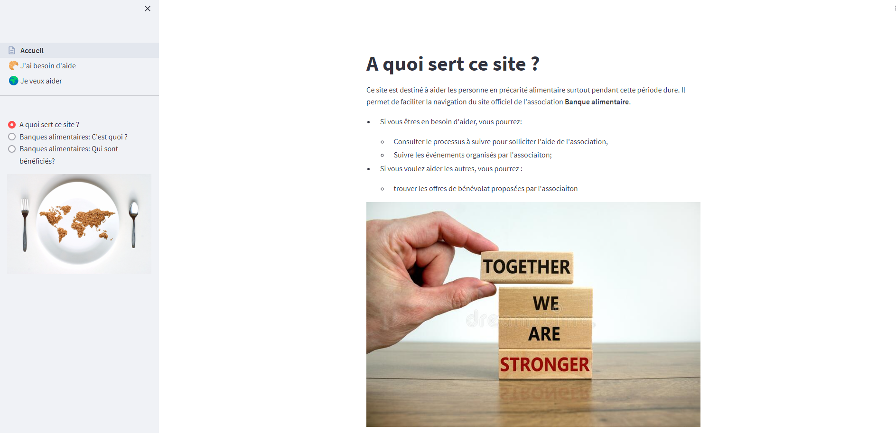
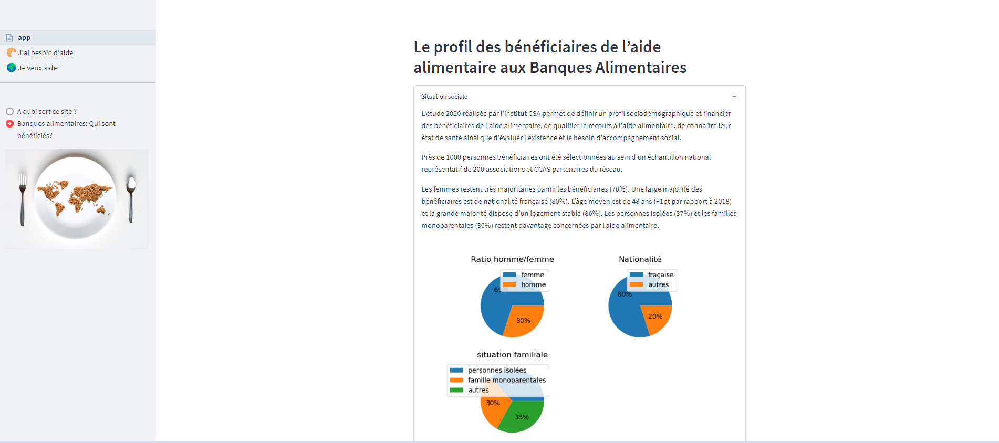
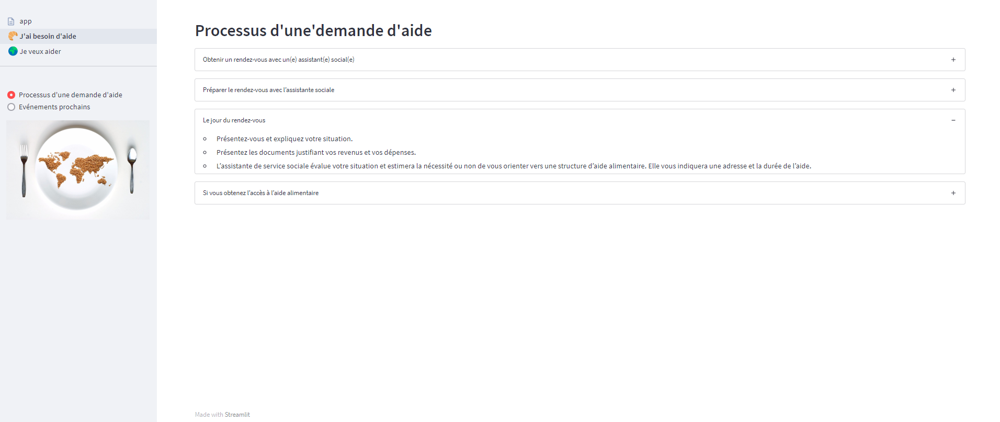
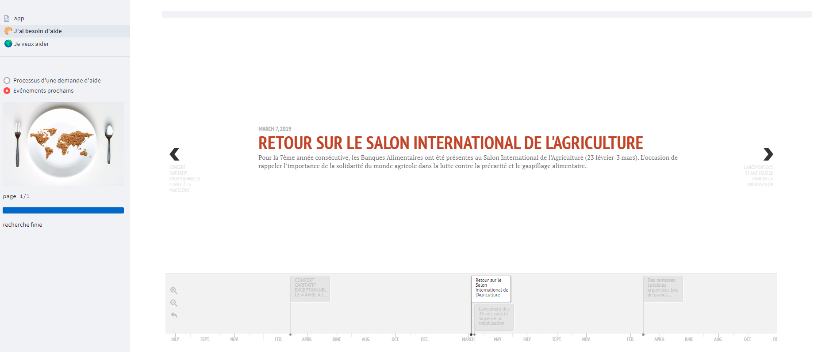
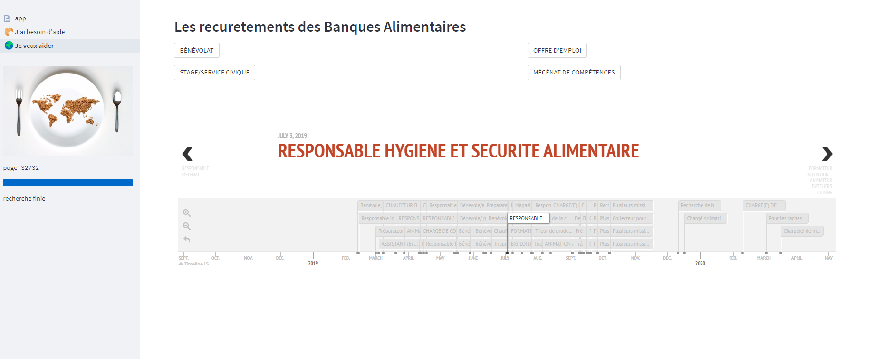

## Application d'extraction de données: aide alimentaire

Cette applicaiton est conçue pour aider les personnes ayant difficulité de se nourrir pendant la crise sanitaire du
covid-19. Les données sont issues du site officiel de l'association [Banque alimentaire](https://bapif.banquealimentaire.org/).

### Environnement du développement
        pipenv --python 3.7
### Lancement de l'applicaiton
Se déplacer dans le dossier extraction.app, et lancer la commande suivante:
        
        streamlit run app.py

### Fonctionnalités mises à jour le 9 juillet 
- Créer un site multipages avec streamlit **1.10.0** et une bar de navigation à gauche. Cependant cette nouvelle structure n'est pas compatible avec d'anciennes versions, ce qui conduit à l'affichage incorrect de certaines pages. Le bon affichage du site aurait du être comme suivant :
.

- Nouveautés sur la page d'accueil:
  - Description générale des fonctionnalités prévues de ce site.
  - Les statistiques sur le profil des bénéficiaires.
.
  
- Nouveautés sur la page "🥐J'ai besoin d'aide":
  - Description du processus à suivre pour solliciter une aide. La page est produite par scrapping.
  .
  - Une vue synthétique des éléments à la une sous format d'un calendrier. Le graphique
  est généré à l'aide de l'application  [TimelineJS3](https://github.com/NUKnightLab/TimelineJS3) embedded en javascript.
  👉[Source du code javascript](https://timeline.knightlab.com/docs/instantiate-a-timeline.html).
  .
  
- Nouveautés sur la page "🌍Je veux aider":

    - Une vue synthétique des offres de stages avec un filtrage par catégorie sous format de boutons. Egalement dévelopée
à l'aide de l'applicaiton TimelineJS3.
  .

### Intérêts:
- Faire un résumé sur les profils des bénéficiaires est un bon moyen de driger les bonne actions de l'assocaiton et d'autres organismes assimilés.
- La présentation en timeline permet de localiser les événements ou les offres d'emploi dans l'espace temporel afin de trouver les buts qui conviennent le plus aux utilisatuers. 

### Droits d'utilisation des sources
Après avoir consulté les condition d'utilisation prescites dans le fichier robots.txt, aucun des liens utilisés n'iterdisent à l'accès des user-agents. 

- timeline_json_format : https://timeline.knightlab.com/docs/json-format.html#json-slide
- timelineJS3: https://github.com/NUKnightLab/TimelineJS3
- intégréer timeline avec js:https://timeline.knightlab.com/docs/instantiate-a-timeline.html